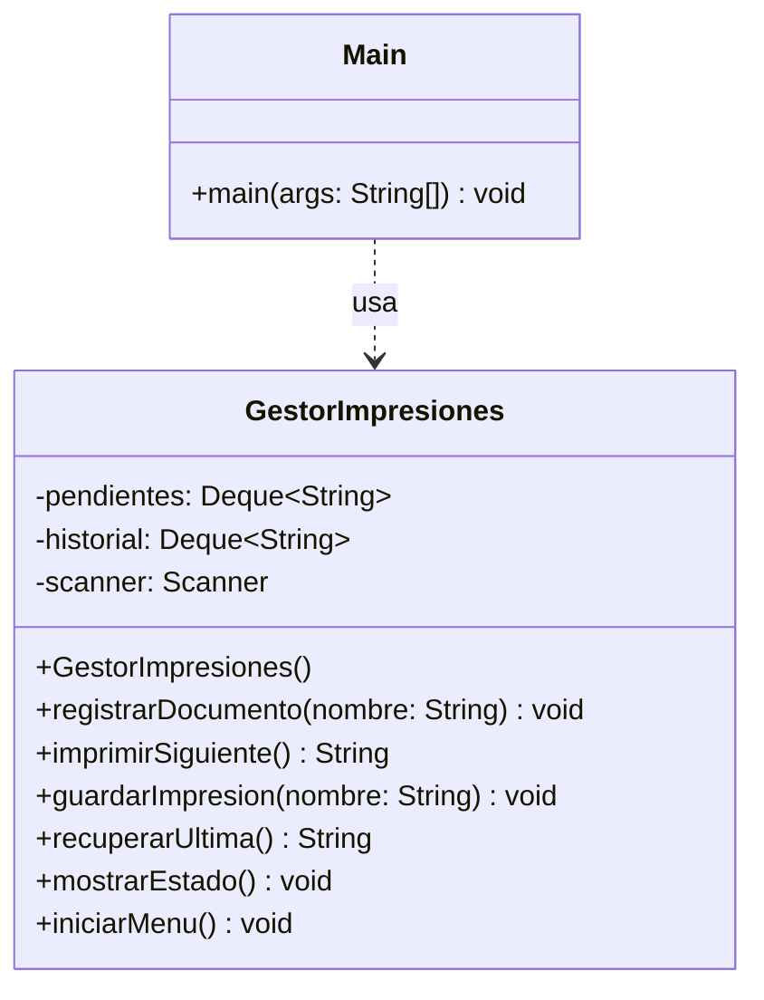

```mermaid
classDiagram
    class Main {
        +main(args: String[]) void
    }
    class GestorImpresiones {
        -pendientes: Deque~String~
        -historial: Deque~String~
        -scanner: Scanner
        +GestorImpresiones()
        +registrarDocumento(nombre: String) void
        +imprimirSiguiente() String
        +guardarImpresion(nombre: String) void
        +recuperarUltima() String
        +mostrarEstado() void
        +iniciarMenu() void
    }
    Main ..> GestorImpresiones : usa
```
